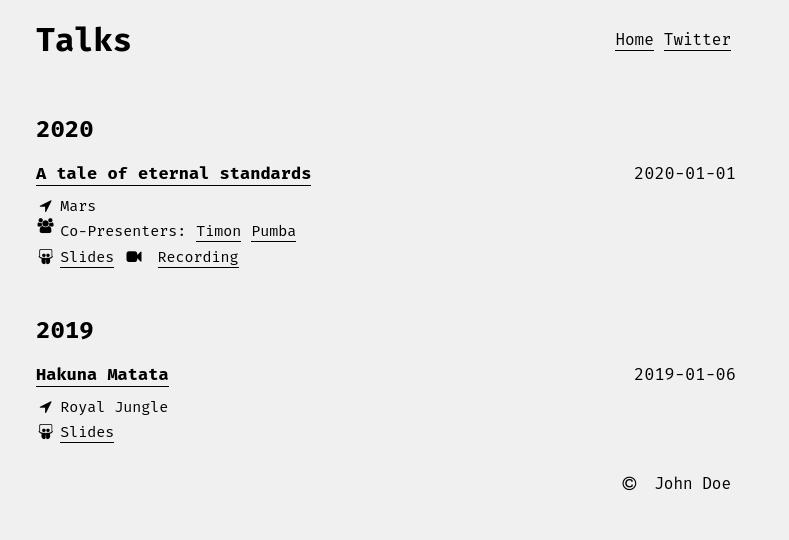

# borno

> "borno" means a letter of the alphabet in Bengali

`borno` is yet another tiny static site generator. I wrote this small tool to build my talk listing.

Slowly, I plan to move to this for my microsite needs.



## Usage

- Clone the repository.

```
$ git clone https://github.com/palnabarun/borno
# cd borno
```

- Run the program

```
$ go run main.go --config examples/example.yaml
```

## Copyright

All code in this repository is under [Apache 2.0 License](LICENSE).

> In the rare instance that you use this generator, a shout out would be really great. :)
